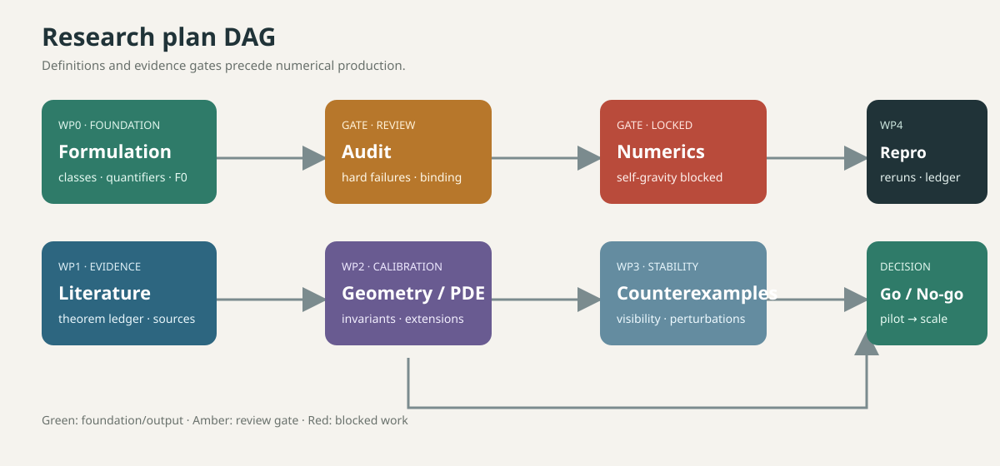
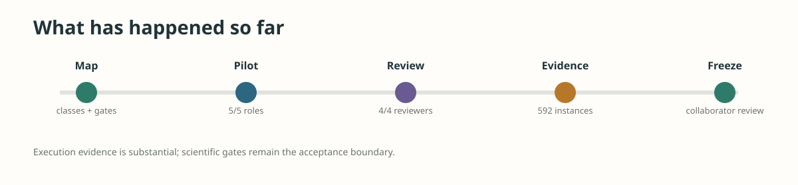

# Cosmic Censorship Swarm Review

> **Frozen collaborator review snapshot · 2026-09-15** The remote swarm is stopped. This repository preserves the evidence map, pilot traces, reviews, validation artifacts, and mathematical claim boundaries for a human collaborator. No WCC or SCC theorem has been promoted.

_Repository audit checked 2026-09-19; the execution snapshot itself remains frozen at 2026-09-15._

## Which repository is authoritative?

This public repository is the **collaborator-facing review surface**. The recommended snapshot is the [`integrated-with-ai4math-swarm` branch](https://github.com/guoshaoyang-pku/cosmic-censorship-swarm-review/tree/integrated-with-ai4math-swarm), currently at commit `69ed753`. It contains the curated README, DAG, dashboard, explainer, progress paper, and review artifacts needed for a mathematical audit.

The `main` branch is the earlier public review line. The larger research repository has a dedicated collaborator development branch, [`swarm-research/ai4math-swarm@collaborator/full-swarm-development`](https://github.com/swarm-research/ai4math-swarm/tree/collaborator/full-swarm-development), currently at `82eff412d`. It is based on the integrated source commit `c40854892`. That branch preserves the raw runtime, audit, ledger, checkpoint, and trajectory inventory. The two repositories are related, but they are not byte-for-byte mirrors: this repository is intentionally a readable, bounded review package rather than a dump of every raw execution file.

| Surface | Role | Current status |
|---|---|---|
| This repo · `integrated-with-ai4math-swarm` | Human-readable collaborator review | **Canonical review snapshot** |
| `ai4math-swarm` · `collaborator/full-swarm-development` | Full integrated source, raw evidence, and active development | **Canonical development line** |
| This repo · `main` | Earlier public review line | Historical entry point; follow the branch above for the frozen snapshot |

No theorem, checkpoint, or raw trajectory should be inferred from a file count. The review branch links to the development line so a collaborator can move from a concise argument to the underlying evidence when needed. The full raw branch is intentionally not mirrored file-for-file: it contains large runtime trajectories, checkpoints, and audit scratch material. The public review package includes the stable summaries and links needed to locate those raw records.

## Start here

1. Read the [初步 blog](docs/cosmic-censorship-swarm-review-20260915.html) for a visual, self-contained account of what the swarm learned and what it did not prove.
2. Open the [interactive review dashboard](docs/cosmic_censorship/pilot/review_dashboard.html).
3. Read the [mathematical progress explainer](docs/cosmic_censorship/pilot/mathematical_progress_explained_20260913.md) and the [Astra progress paper](docs/cosmic_censorship/pilot/astra_progress_paper_20260913.md).
4. Inspect the [evaluation report](docs/cosmic_censorship/pilot/evaluation_report.md), [gate checklist](docs/cosmic_censorship/pilot/gate_checklist.md), [role outputs](docs/cosmic_censorship/pilot/runs/), and [independent reviews](docs/cosmic_censorship/pilot/reviews/).
5. Read the [frozen final snapshot](docs/cosmic_censorship/pilot/final_snapshot_20260914.md) for the checkpoint-level inventory.
6. For provenance and integration details, read the [ai4math integration snapshot](docs/cosmic_censorship/pilot/ai4math_integration_snapshot_20260914.md).

## Current disposition

| Signal | Frozen value | Interpretation |
|---|---:|---|
| Recorded events | **9,367** | Last accepted event count in the project checkpoint |
| Registered artifacts | **656** | Files or evidence objects in the registry; not theorem count |
| Map validator | **VALID** | Research-map schema and references pass validation |
| Active remote sessions | **0** | No controller, supervisor, or worker is running |
| N1 self-gravitating numerics | **LOCKED** | Calibration is allowed; production search is gated |
| Promoted theorem | **0** | No WCC/SCC claim passed the scientific gates |

The remote run ended at the last checkpoint on 2026-09-14 22:59:46 +0800. There is no automatic refill, provider failover, or automatic push. Historical artifacts remain available for audit.

## Mathematical spine: the nodes worth checking

The formulas below are the compact mathematical spine of the project. They organize the questions and diagnostics; they are **not new theorems proved by the swarm**. Every formula must still be read together with its class id, hypotheses, regularity threshold, and evidence grade.

### 1. Field equations and the formulation tuple

The ambient problem starts from

$$
G_{\mu\nu}(g)+\Lambda g_{\mu\nu}=8\pi T_{\mu\nu},
$$

but a usable research claim is the entire tuple

$$
\mathfrak C=(\text{equations},\dim\,M,\text{topology},\text{data class},\text{asymptotics},\text{visibility},\text{regularity},\text{genericity},\text{conclusion}).
$$

Changing any coordinate of `𝔠` can change the theorem being discussed. This is why `AF-WCC-VAC-GEN`, `AF-SCC-C2-VAC-GEN`, `AF-SCC-C0-VAC-GEN`, and the spherical scalar calibration lane are kept as different classes.

### 2. WCC and SCC are different logical targets

A schematic WCC visibility condition is

$$
J^{-}(\mathscr I^{+})\cap\mathcal S=\varnothing,
$$

where the definition and regularity of `𝓘⁺`, the singular set `𝓢`, and the genericity topology must be declared. A schematic SCC statement instead asks for inextendibility in a specified class `𝓧`:

$$
\nexists\,\widetilde g\supsetneq g\quad\text{with}\quad\widetilde g\in\mathcal X,\qquad \mathcal X\in\{C^{0},C^{2},\text{weak Einstein--Christoffel-}L^{2},\ldots\}.
$$

The regularity label is part of the conclusion. In particular,

$$
C^{2}\subset C^{1,1}\subset C^{0},
$$

so a `C⁰` extension result does not by itself settle a `C²` SCC claim, and curvature blow-up does not by itself establish WCC visibility.

### 3. Focusing and trapped-surface diagnostics

For a null congruence with tangent `kᵃ`, the twist-free Raychaudhuri equation is

$$
\frac{d\theta}{d\lambda}=-\frac12\theta^{2}-\sigma_{ab}\sigma^{ab}-R_{ab}k^{a}k^{b}.
$$

This is the local focusing mechanism. In spherical diagnostics, with area radius `r` and null directions `ℓ₊,ℓ₋`,

$$
\theta_{\pm}=\frac{1}{4\pi r^{2}}\mathcal L_{\ell_{\pm}}(4\pi r^{2})=\frac{2}{r}\ell_{\pm}(r).
$$

A trapped-surface or marginal-expansion signal is a diagnostic that must still be tied to causal propagation and invariant checks; it is not automatically an event horizon or a naked singularity.

### 4. Misner–Sharp mass and numerical convergence

In spherical symmetry, the Misner–Sharp relation is

$$
1-\frac{2m}{r}=g^{ab}\nabla_{a}r\nabla_{b}r.
$$

For a refinement step `h → h/2`, the observed convergence order is

$$
p_{\mathrm{obs}}(h)=\log_{2}\frac{E(h)}{E(h/2)}.
$$

These expressions validate geometry and numerics only after resolution, boundary, gauge, constraint, and independent-rerun checks. They cannot promote a calibration lane into a generic `3+1` vacuum theorem.

### 5. The numerical gate is intentionally conjunctive

The locked self-gravitating lane follows the explicit gate

$$
\operatorname{Unlock}(N_{1})\Longleftrightarrow G_{\mathrm{FORM}}\land G_{\mathrm{AUDIT}}\land G_{\mathrm{NUM}}=\mathrm{pass}.
$$

At the frozen snapshot, this condition is false: `N1` remains locked and `N0` is calibration only.

## What the swarm has done

- Split cosmic censorship into auditable classes: AF-WCC vacuum, AF-SCC-C2/C0, low-regularity extensions, spherical Einstein–scalar calibration, Kerr/Cauchy-horizon, charged, de Sitter, AdS, and higher-dimensional variants.
- Frozen the formulation fields: equations, dimension/topology, initial-data space, asymptotics, gauge, singularity, visibility, extension regularity, genericity, conclusion type, reproducibility, and evidence grade.
- Defined the research teams and dependency DAG: formulation, literature, geometry/PDE, numerics, counterexamples, symbolic/formal work, and reproducibility/review.
- Completed the first five-role DeepSeek Flash pilot (5/5), followed by four independent review roles (4/4).
- Rejected the first fluent formulation because it conflated WCC/SCC and C0/C2 and lacked sufficiently specified genericity, visibility, and citations.
- Recorded 592 finished group instances: formulation 145, literature 148, numerics 150, audit 149. These are execution traces, not accepted theorems.
- Captured the DeepSeek quota stop, quota circuit, stale-metadata correction, project namespace filtering, and recovery-probe hardening.

The old DeepSeek runners are retained only as historical reproducibility artifacts; they are not active launchers.

## Mathematical claim boundary

The useful output is a research map and an evidence protocol. It identifies which statement is being discussed, under which regularity and asymptotic assumptions, and what observation would count as evidence. It does not settle the conjecture. In particular:

- a visible causal boundary is not automatically a curvature blow-up;
- a C0 extension question is not a C2 inextendibility theorem;
- a spherical calibration is not evidence for generic 3+1 behavior;
- a numerical trend is not a proof without convergence, invariant diagnostics, and an independent rerun.

The 27-fixture regression suite is a software check, not a physical theorem. Its frozen result is TP=17, FP=0, TN=10, FN=0 for the fixed fixtures only.

## Current scientific and operational state

| Area | State | Review meaning |
|---|---|---|
| Formulation taxonomy | Established | Classes, fields, versions, and dependencies are reviewable |
| Scientific review | Working | Fluent but invalid scope was rejected |
| Literature/citations | Continuing | Primary-source verification remains required |
| Flat-space numerics | Calibration only | Self-gravitating production remains locked |
| Runtime lifecycle | Real evidence, needs hardening | Independent instances and trajectories are recorded |
| Multi-provider failover | Not complete | Adapter, account rotation, retry ledger, and drills remain |
| Unattended scale | No-go | First pass provider A→B and 5xx/timeout drills |

## Next research path

WP0 freezes terminology and formulation. WP1 builds the theorem ledger with source locations. WP2–WP3 complete spherical calibration, geometry, visibility, and convergence checks. WP4 handles low-regularity extension questions. WP5–WP6 begin axisymmetric/3D candidates only after formulation, literature, and audit gates are green. WP7–WP8 cover formalization, independent reruns, synthesis, and go/no-go.

## Evidence boundary

This repository does not claim a proof or refutation of cosmic censorship. Counts such as 9,367 events, 656 artifacts, 592 historical instances, 5/5 roles, and 4/4 reviewers describe execution and review records; they do not replace theorem verification, citation checks, invariant diagnostics, convergence tests, or independent reproduction.
