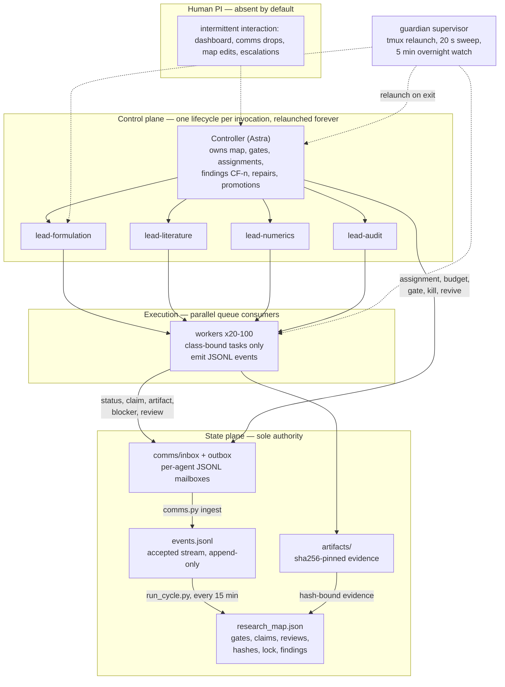
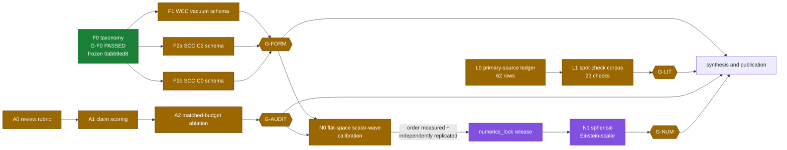

# Cosmic Censorship Research Swarm

**An autonomously operating, verifier-gated agent swarm attacking the Penrose cosmic censorship
conjectures — with every claim bound to hash-pinned artifacts and independent review.**

*Sole global state: `research_map/research_map.json` — re-measure hashes before citing; traffic never stops.*

---

## 1. Mission

Decide, with machine-checkable evidence, what can be proved about **weak and strong cosmic
censorship** (WCC/SCC) in the Einstein–scalar system — by splitting the conjectures into
non-leaking formulation classes (F0 taxonomy, F1 WCC, F2a SCC-C2, F2b SCC-C0), building a
primary-source theorem ledger, calibrating numerics only behind gates, and auditing every claim
with independent reviewers. **Fluent text is never promoted to a theorem.** A result is an
artifact plus gate evidence referenced by sha256 — not a message, not a consensus, not a summary.

## 2. Live status (pass 09, 2026-09-12)

| gate | scope | verdict | frozen evidence |
|---|---|---|---|
| **G-F0** | canonical taxonomy + companion supplement | **PASSED** | `0abb9ed8a961` (rev5) + `d7419b4e8963`, frozen under rev28 `2f358f6722d9`; 7 accepts from 5 distinct independent reviewers; any write to `formulation_taxonomy.yaml` voids the gate |
| G-FORM | F1 / F2a / F2b schemas | pending | rev12 `cce9c60146d6` / `5476a3f2c6bc` / `55d0a1ea9bda`; ≥2 independent full-scope accepts required; evidence-binding repairs in flight |
| G-LIT | L0 ledger / L1 spot checks | pending | L0 `a1674f094979` (62 rows), L1 `315c19145065` (23 spot checks) |
| G-NUM | numerical protocol | pending | protocol `1e6cdf04d7a2` contested (accept 4.5 vs two revise on re-based evidence) |
| G-AUDIT | A0 rubric / A1 scoring | pending | A0 `d748a9e3574e`; 20 CLASSSEP hard findings under the CF-16 metalinguistic-mention pattern |

- **`numerics_lock`: LOCKED** (since 2026-09-11T23:15+08:00). N1 self-gravitating runs are frozen;
  only N0 flat-space calibration is allowed. Release requires G-FORM **and** G-AUDIT passed, plus
  a measured and independently replicated N0 convergence order.
- Controller findings **CF-1 … CF-33** open/closed in `research_map.json → controller_findings`;
  gate audit trail in `controller_gate_audit`; repairs in `controller_repairs`.
- Scale to date: **23 controller lifecycles**, **8,543 accepted events**, **32,440 artifact files
  (1.3 GB)**, **15,832 supervised agent instances** (543 MB of trajectories in `runtime/`).

## 3. Architecture

Three layers, a state plane that is the only authority, and a guardian that makes every layer
self-waking. Humans are absent by default and intervene intermittently at high frequency.

**Why nothing stalls.** Each agent (controller, lead, worker) runs *one bounded lifecycle*:
cold-start from the handoff bundle, consume its inbox, do one pass of adjudication/execution,
checkpoint, exit. The guardian (`harness/independent_supervisor.sh`, `harness/supervise_loop.sh`)
relaunches it within 20 s; 15,832 relaunches are on record. Between controller passes,
`research_map/run_cycle.py` auto-applies accepted events every 15 minutes, so the map advances
even when the controller is between lives. State lives entirely in files — a restart loses
nothing but the in-flight prompt.

**Communication contract** (`comms/PROTOCOL.md`): upward `status / claim / artifact / blocker /
direction_update / resource_request / review`; downward `assignment / budget / gate /
priority_change / kill / revive`. Workers **cannot** set `status=done`, `validation_status=passed`,
or any gate verdict — only controller and leads can, and only with artifact + review evidence.

## 4. Research plan and DAG

### Portfolio, burn and ETA

| group | direction | agents | spent / budget (h) | ETA | state |
|---|---|---:|---:|---:|---|
| formulation | split WCC/SCC classes, prevent leakage | 6 | 38 / 160 | 3–6 d | F0 done; F1/F2a/F2b in repair-and-review |
| literature | primary-source theorem scope + citations | 5 | 42 / 220 | 5–10 d | L0 ledger adjudicating; L1 spot checks |
| numerics | flat-space calibration only (locked) | 4 | 22 / 320 | 10–21 d | N0 active behind lock; N1 frozen |
| audit | rubric, scoring, hard failures, IG | 5 | 55 / 180 | 2–5 d | A0 rubric; CLASSSEP adjudications |

**Totals:** 20 active agents (scalable to 100), 157 / 880 agent-hours (~18% burn).
**Dependency critical path: ~13–21 calendar days**, gated by G-FORM + G-AUDIT before the
numerics lock can release.

### Phase plan

| phase | content | status |
|---|---|---|
| P0 | protocol, map schema, dashboard, guardian harness | done (Sep 10–11) |
| P1 | F0 canonical taxonomy through independent review | **done — G-F0 passed** (Sep 12 00:31) |
| P2 | close G-FORM, G-LIT, G-AUDIT at frozen hashes | in progress (ETA 3–10 d) |
| P3 | release numerics lock, N0 convergence order, N1 production | queued (ETA 10–21 d) |
| P4 | A2 four-arm matched-budget ablation, synthesis, publication | queued (behind gates) |

## 5. Operating model at scale

- **Budget is not a stop rule; gates are.** The operating budget is effectively unlimited
  (10^5 USD/day class). Nothing in the loop counts tokens to decide when to stop — work stops
  only when a gate passes, a stop rule fires, or the Human PI kills it.
- **Max reasoning effort everywhere, by design.** Longer-lived single processes amortize the
  cold-start re-read of a map that has grown past 100k lines; 15,832 relaunches measured exactly
  the communication overhead this policy removes. Two engineering guards travel with it:
  (1) explicit, generous completion-token budgets and timeouts — a starved reasoning model returns
  **empty content that looks like silence** (this cost a full factorial arm once, see base
  `HANDOFF.md`); (2) channel concurrency ceilings are *measured per provider*, never assumed
  (the legacy gateway hard-failed above ~16 concurrent).
- **Heterogeneity is measured, not assumed.** Per-family accounting is mandatory; mixed runs are
  paired with single-family controls; dead ends broadcast, winners stay island-local.
- **Monitoring.** `harness/overnight_watch.sh` samples sessions/artifact-flow every 5 minutes
  into JSONL; the dashboard renders the map; `runtime/state/` holds per-pass verification reports,
  decisions (REC-n) and checkpoints (`ckpt-*`).

## 6. Handover

This swarm is handed over to an industry collaborator for large-scale execution.

| role | model (all at max effort) |
|---|---|
| Driver / controller (owns the map) | **Fable 5.1** |
| Group leads | **Astra or Sol or Opus 5** |
| Execution agents | **Opus 5 or Sol** |

**Cold-start procedure for any new controller or lead** (this is the entire onboarding):

1. Read `research_map/ASTRA_HANDOFF.md` (live controller state, current hashes, open assignments).
2. Read `research_map/research_map.json` (sole authority), `research_map/ARCHITECTURE.md`,
   and the base `HANDOFF.md` (measurement discipline and known traps).
3. Read your mailbox `comms/inbox/<agent-id>.jsonl`; protocol in `comms/PROTOCOL.md`.
4. Run `python3 research_map/validate_map.py` — expect `VALID` before acting.
5. Work one bounded lifecycle; checkpoint; exit. The guardian relaunches you.

**Operator dependencies to replace on her stack:** the current harness launches headless CLI
sessions through `dsh_fixed.sh` (a DeepSeek wrapper from a sibling project, referenced in
`harness/*.sh`) — substitute the driver CLI that speaks to Fable 5.1 / Sol / Opus 5. The worker
prompts in `harness/supervise_loop.sh` are model-agnostic templates.

**Key policy:** API keys never enter this repository. Runtime credentials live outside the tree
(`~/.dsh/.credentials.yaml`, `~/.maso/model-providers.yaml`, `SWARM_PROVIDERS` env override).
A full-tree secret scan preceded every push of this branch.

## 7. Repository map

| path | what |
|---|---|
| `research_map/` | the map, accepted-event stream, lifecycle tooling (`astra_lifecycle*.py`, `apply_events.py`, `run_cycle.py`, `comms.py`, `promote.py`, `checkpoint.py`, `accounting.py`, `audit_evidence.py`, `class_separation.py`), validator, schemas, dashboard (`research_map.html`) |
| `artifacts/` | hash-pinned evidence tree: per-worker outputs, frozen bytes, reviews, adjudications (~1.3 GB) |
| `comms/` | per-agent JSONL mailboxes (`inbox/`, `outbox/`), `PROTOCOL.md`, `rejected.jsonl` |
| `runtime/` | supervised instance trajectories (15,832), controller verification reports, checkpoints, state |
| `harness/` | guardian + launcher scripts (`launch_swarm.sh`, `supervise_loop.sh`, `independent_supervisor*.sh`, `overnight_watch.sh`, monitors) and the local review/closure artifact set |
| `framework/` | inherited verifier-gated search layer from `main`, kept as a control layer (`capset` task only). The Erdős task material (`erdos64/`, `data/`, `runs/`) was removed from this branch — full narrative in `main`'s history; distilled lessons live in `HANDOFF.md`. This branch does not depend on `framework/` |

Dashboard: open `research_map/research_map.html` in a browser (reads the map JSON directly;
Mermaid rendering via external JS).

## 8. Epistemic rules (non-negotiable)

1. Never claim a theorem, counterexample, or numerical result from fluent text alone.
2. A completed node requires the declared artifact **and** validation evidence at a frozen hash.
3. Workers cannot mark `done` / `passed`; only leads and the controller can, with independent review.
4. ≥2 independent reviewers bind a gate; reviewer agreement is tracked, not trusted.
5. Any write to frozen bytes voids its gate (e.g., touching `formulation_taxonomy.yaml` voids G-F0).
6. Keep WCC, SCC-C2, SCC-C0 as separate classes — never "C0 or C2"; class leakage is a hard failure.
7. Numerics stay locked until formulation and audit gates pass, plus a replicated N0 order.
8. Matched-budget baselines before any claim of swarm advantage.
9. A failed gate is recorded as progress, and the budget is redirected.

---

*The generic verifier-gated search framework and the Erdős-program measurements that forced this
design live on `main`. This branch is self-contained: the map, the protocol, the harness, and the
full evidence tree for the cosmic-censorship campaign.*
